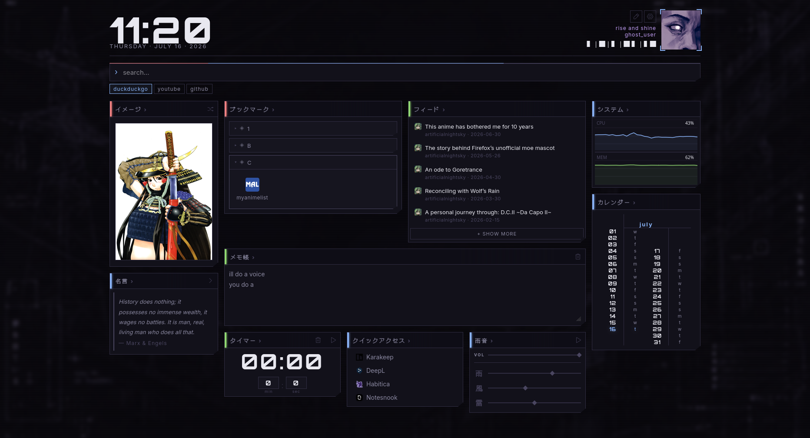

<div align="center">
  <h1>無ホム · muhomu</h1>
</div>

---



### Quick start

#### Using a pre-built image (GHCR)

```
docker run -d \
  --name muhomu \
  -p 4444:4444 \
  -v ./data:/data:z \
  ghcr.io/gary-host-laptop/muhomu:latest
```

Or with Docker Compose:

```yaml
services:
  muhomu:
    image: ghcr.io/gary-host-laptop/muhomu:latest
    ports:
      - "4444:4444"
    volumes:
      - ./data:/data:z
    restart: unless-stopped
```

#### Building from source

```
docker compose up -d --build
```

Open `http://localhost:4444`. Edit `data/config.yaml` and restart to reconfigure.

Or run directly:

```
go run . -config ./data/config.yaml
```

---

### Config

All layout lives in `data/config.yaml`. Columns declare their size (`small` = 250px, `full` = 1fr) and ordered list of widgets:

```yaml
columns:
  - size: small
    widgets:
      - id: image
      - id: quote
  - size: full
    widgets:
      - id: bookmarks
      - id: notes
      - id: split-column
        options:
          max-columns: 2
          widgets:
            - id: timer
            - id: quick-access
  - size: small
    widgets:
      - id: system-stats
      - id: calendar
```

Available widgets: quick-access, bookmarks, notes, recently-visited, rss, quote, kotoba, system-stats, timer, rain, image, calendar, status.

---

### Images

Drop files into host-mounted directories: `profile-images/`, `bg-images/`, `widget-images/`. Supported: jpg, jpeg, png, webp, gif, avif.

---

### Data

User content (bookmarks, notes, quotes, quick access, recently visited) is stored in SQLite at `data/muhomu.db` and edited on the dashboard. Configuration is never stored in the database.

---

### Flags

```
-port    string   port to listen on (default "8080")
-data    string   data directory (default "./data")
-config  string   config file path (default "./data/config.yaml")
-static  string   static files directory (default "./static")
```
